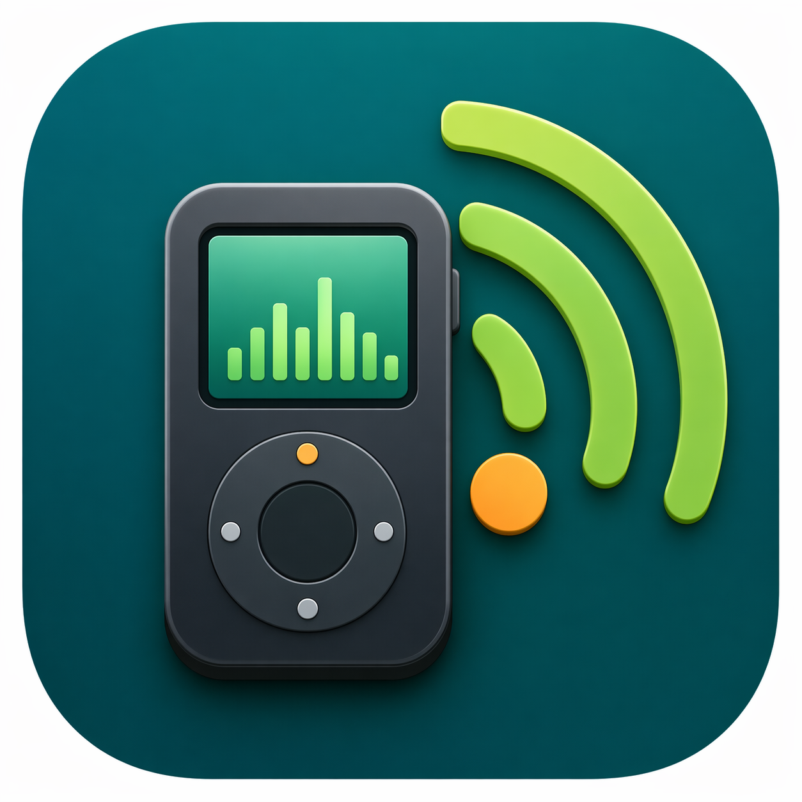

# Simple Podcast Manager

<p align="center">
  
</p>

Simple Podcast Manager is a native macOS app for a plain RSS-to-MP3-player workflow:

plug in device -> click sync -> done

It is built for people who want to own their podcast subscriptions, download normal audio files, and copy MP3s to a standalone player without a hosted account or platform lock-in.

## Install

Download the DMG from the latest [GitHub Release](https://github.com/steveneely/simple-podcast-manager/releases), open it, and drag `Simple Podcast Manager.app` to Applications.

Current prerelease builds are not Developer ID signed or notarized yet, so macOS may ask you to approve opening the app manually.

## What It Does

- Subscribe to podcasts with RSS feed URLs.
- Download episodes and convert non-MP3 audio with bundled `ffmpeg` in release builds.
- Review the full-device plan before changing your MP3 player.
- Copy managed episodes to the device and delete selected managed episodes from it.
- Remember downloaded and removed episodes.
- Cache feed previews locally for faster startup, then refresh feeds in the background.
- Export and import subscriptions, settings, and local history.
- Check GitHub Releases for updates.

The app is local-first: no backend service, hosted account, Spotify dependency, or Apple Podcasts library integration.

## Help

New users should start with the [User Manual](docs/USER_MANUAL.md).

For technical context, see [Architecture](ARCHITECTURE.md).

## Development

Run tests:

```bash
./scripts/swift-test.sh
```

Run from source:

```bash
swift run "Simple Podcast Manager"
```

Build a local DMG:

```bash
FFMPEG_PATH=/path/to/ffmpeg \
FFMPEG_SOURCE_URL=https://example.com/ffmpeg-source-or-build-recipe \
./scripts/build-release.sh
```

For public releases, set `DEVELOPER_ID_APPLICATION` and `NOTARY_PROFILE` to sign, notarize, and staple the DMG.

## License

Simple Podcast Manager is available under the [MIT License](LICENSE). Third-party components are licensed separately; see [THIRD_PARTY_NOTICES.md](THIRD_PARTY_NOTICES.md).
